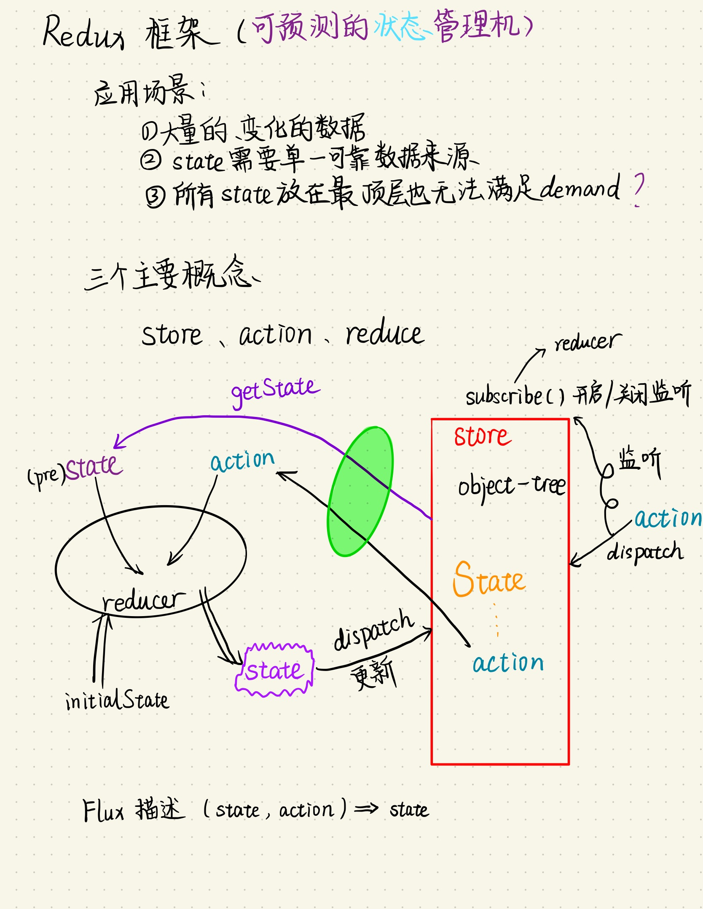
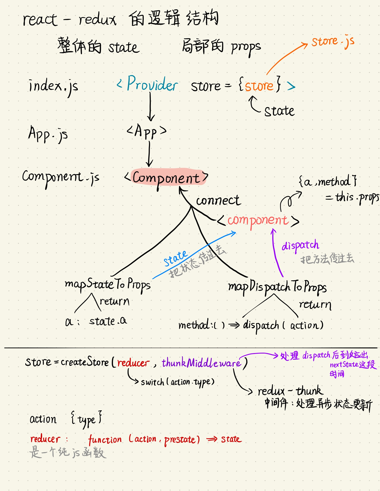

# Webpack + React + Redux 样例教程
## Author
CoderAt
## Date
2019.3.1
## Environment
Mac OS X mojave
## Target
看懂一份[Example](https://github.com/cornflourblue/react-redux-registration-login-example)代码

## Introduction
这是一篇踩了无数坑而来的最简版counters的Webpack + React + Redux教程,用最简单的计数器counter为例子,从零开始边搭建边学习。

## How To Init
先搭建最基本的框架，打开Facebook的create-react-app的Github网页[create-react-app](https://github.com/facebook/create-react-app)
根据教程开始（如下)
(```)
    $ npx create-react-app my-app
    $ cd my-app
(```)
这时候想直接看效果的话直接输入
`$ npm start`
**mp-app**就是一个默认的react框架，但里面并没有详细的webpack.config，需要运行不可逆命令
`$ npm run eject`

## File Introduction
项目的所有文件裸露出来，出现了想要的**config**和**public**文件夹
在webpack.config.js中565行左右有服务器链接首页的设置*index.html*
*index.html*在**public**文件夹中
**src**中，index.js是最顶层文件，直接作用于index.html

## Install Redux
You can make a shell file to do the following things.Just like *react-redux.sh*
(```)
    $ npm install --save redux
    $ npm install --save react-redux
    $ npm install --save redux-logger
    $ npm install --save redux-thunk
    $ npm install --save react-router-dom
(```)
1. react-redux For { Provider, connect}
2. redux-thunk For { thunkMiddleware }

## First to know how Redux works


## How to connect Redux and React

Pay attention to the most important things:
1. **Provider** and **connect**
2. **state** and **props**
3. **action** 、**method** and **dispatch**

## Ever Trapped
1. Where is the react's webpack config?
2. What's the logical relationship of store、reduce、action、state、props、dispatch？
3. How to get state's data from the store?
4. How store subscribe the dispatch(action)?
5. How reducer get the prestate and action?

## Reference
[React 实践心得：react-redux 之 connect 方法详解](https://yq.aliyun.com/articles/59428)
[Redux中文文档](http://cn.redux.js.org/index.html)
